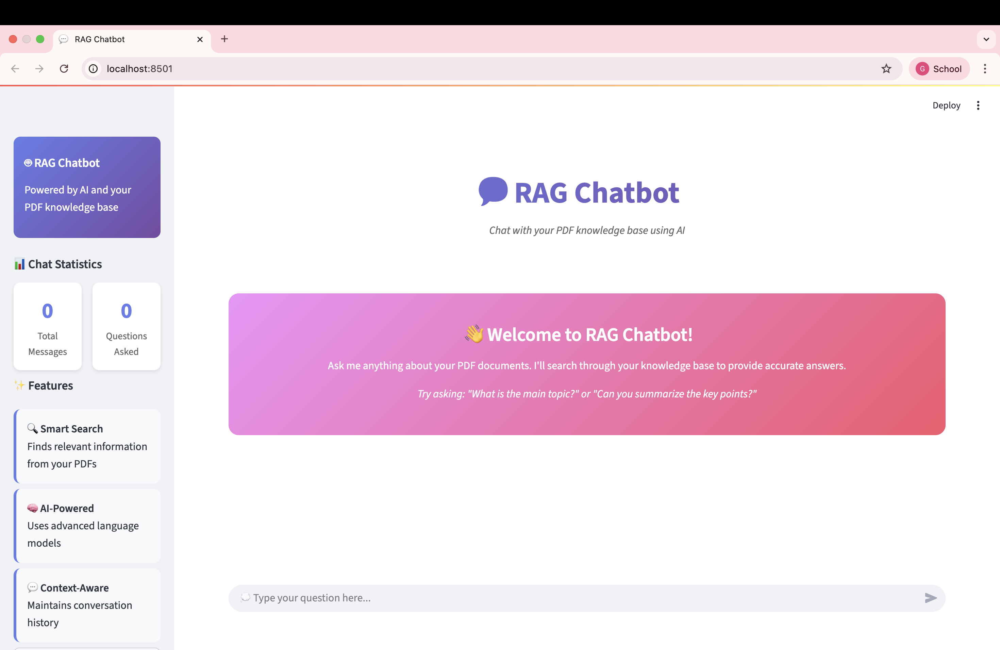
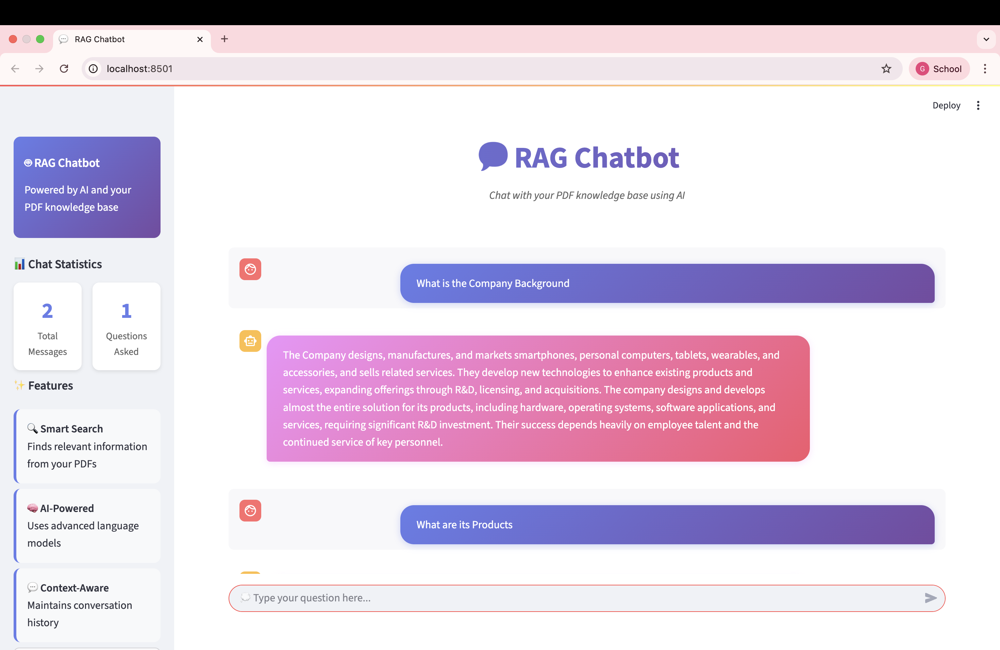
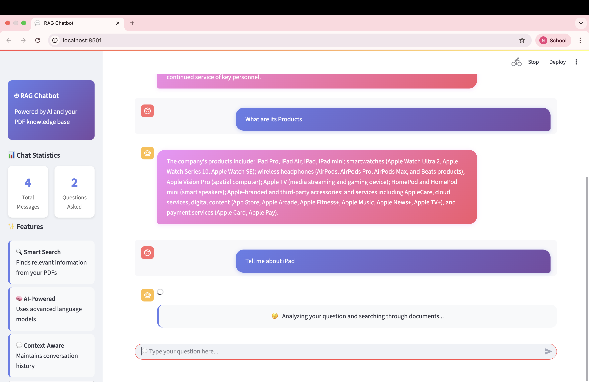

# 💬 RAG Chatbot with Streamlit + LangChain + Google Gemini

A **Retrieval-Augmented Generation (RAG) chatbot** built with **Streamlit**, **LangChain**, and the **Google Gemini API**.  
This chatbot lets you **upload and query your PDF knowledge base**, retrieving **context-aware answers** in a smooth chat-like interface.

---

## 🚀 Features

- 📄 **PDF Knowledge Base** → Chat directly with your documents  
- 🔍 **Smart Retrieval** → Uses **Chroma DB** for persistent vector storage  
- 🧠 **AI-Powered Responses** → Powered by **Google Gemini LLM**  
- 🧩 **Semantic Chunking** → Uses `SemanticChunker` for meaningful document splitting  
- 💬 **Real-time Chat** → User messages on the right, bot responses on the left  
- ⏳ **Streaming Mode** → Word-by-word typing effect for a natural chatbot feel  
- 📊 **Live Statistics** → Track total messages & questions in sidebar  
- 🗑️ **Clear Chat** → Reset conversation anytime  

---

## 📂 Project Structure

**rag-chatbot/**  
**│── main.py** – Streamlit UI and chatbot logic  
**│── vector_store.py** – Creates/loads Chroma vector DB  
**│── splitter.py** – Splits PDFs into semantic chunks  
**│── loader.py** – Loads PDF documents  
**│── config.py** – API keys, model setup, DB paths  
**│── AppleData-2024.pdf** – Sample knowledge base PDF  
**│── requirements.txt** – Python dependencies  
**│── README.md** – Project documentation  
**│── .env** – Store Google API key here  


---

## 🛠️ Installation

1. **Clone the Repository**
   ```bash
   git clone https://github.com/Gurkaran017/RAG-Chatbot.git
   cd rag-chatbot

2. **Install Dependencies**
   ```bash
   pip install -r requirements.txt

3. **Setup Environment Variables**
   ```bash
   GOOGLE_API_KEY=your_google_api_key_here

---

## ⚙️ How It Works (Architecture)

### 🔹 Step 1: Document Loading
- Uses `PyPDFLoader` from `langchain_community`  
- Loads all text from **AppleData-2024.pdf**

### 🔹 Step 2: Semantic Chunking
- Uses **SemanticChunker** with **Google Embeddings**  
- Breaks the document into **meaningful sections** instead of fixed-size chunks

### 🔹 Step 3: Vector Database (ChromaDB)
- Stores embeddings in **ChromaDB (persistent)**  
- Automatically reuses existing DB if available

### 🔹 Step 4: Query Retrieval
- User query → Expanded into multiple queries using **MultiQueryRetriever**  
- Fetches **top k=3** most relevant chunks from Chroma

### 🔹 Step 5: Prompt + LLM
- Builds a **prompt template** with:  
  - Conversation history  
  - Retrieved context  
  - Latest question  
- Sends it to **Google Gemini (`gemini-1.5-flash`)**

### 🔹 Step 6: Streaming Response
- LLM response streamed **word-by-word**  
- Typing effect for a **natural chat experience**


---

## 📊 Example Workflow

### 1. Start the App
- Loads **PDF** + **Chroma DB**

### 2. Ask a Question
- Example: *“Summarize key points”*

### 3. Retrieve Relevant Chunks
- Retriever fetches **top matching sections** from the document

### 4. Generate Response
- **Gemini LLM** creates a contextual answer

### 5. Display Answer
- Chat interface shows the response with a **typing animation**

---

## 📷 Screenshots  

### 1. Welcome Page  
  

### 2. User Asking Question  
  

### 3. Bot Responding with Typing Effect  
  


---

## 📌 Dependencies

### 🐍 Python
- Python **3.9+**

### 📦 Core Libraries
- **Streamlit**  
- **LangChain**  
- **LangChain-Community**  
- **LangChain-Chroma**

### 🗄️ Optional
- **FAISS** → optional backup vector database

### 🤖 AI Model
- **Google Generative AI (Gemini)**

3. **Install via:**
   ```bash
   pip install -r requirements.txt

---

